<div align="center">
  
# 👋 Hello, I'm Xavier Gael

<div align="center">
  
</div>

<br>

<div align="center">
  
</div>

<br>

<p align="center">
  
  
  
</p>

</div>

---

## 🚀 About Me

```typescript
const xavier: Developer = {
  role: "Junior Web Developer",
  education: "4th Year Computer Science Student",
  location: "Philippines",
  currentFocus: ["Full-Stack Development", "Modern Web Technologies"],
  learningGoals: ["System Design", "Cloud Architecture", "DevOps Practices"],
  interests: ["Clean Code", "User Experience", "Problem Solving"],
  motto: "Code with purpose, learn with passion"
};

console.log(`Welcome to ${xavier.role}'s profile! 🎉`);
```

---

## 🛠️ Technology Stack

<div align="center">

### 🎨 Frontend Development
<p>
  
  
  
  
  
</p>

### 📱 Mobile Development
<p>
  
</p>

### ⚙️ Backend & Database
<p>
  
  
  
  
</p>

### 🔧 Tools & Platforms
<p>
  
  
  
  
</p>

</div>

---

## 📈 GitHub Analytics

<div align="center">
  
  
</div>

<div align="center">
  
</div>

---

## 🎯 Current Goals

```mermaid
graph LR
    A[🎓 Complete CS Degree] --> B[💼 Land Full-Time Role]
    B --> C[🚀 Master Full-Stack]
    C --> D[☁️ Learn Cloud Technologies]
    D --> E[🏆 Contribute to Open Source]
```

<div align="center">



</div>

**2025 Objectives:**
- 🎯 Build successful projects to my client's demands
- 📚 Master system design fundamentals
- 🤝 Contribute to open-source projects
- ☁️ Learn cloud development
- 🌐 Expand professional network

---

## 🌟 Beyond Coding

<div align="center">
  
| 🎸 **Music** | 🎮 **Gaming** | 🌿 **Nature** | 📚 **Learning** |
|:------------:|:-------------:|:-------------:|:---------------:|
| Guitar Enthusiast | Strategy Games | Hiking & Trails | Tech Podcasts |
| *Relaxation* | *Problem Solving* | *Inspiration* | *Growth* |

</div>

---

## 🤝 Let's Connect

<div align="center">
  <a href="mailto:xgael.sanjuan@gmail.com">
    
  </a>
  <a href="https://github.com/Guheil">
    
  </a>
  <a href="https://linkedin.com/in/your-profile">
    
  </a>
  <a href="https://twitter.com/your-handle">
    
  </a>
</div>

<div align="center">
  <br>
  
</div>

---

<div align="center">
  
### 💭 *"Every expert was once a beginner. Every pro was once an amateur."*

**⚡ Powered by curiosity and fueled by coffee ☕**

<sub>🛠️ Crafted with passion by Xavier Gael | Last updated: 2024</sub>

</div>
